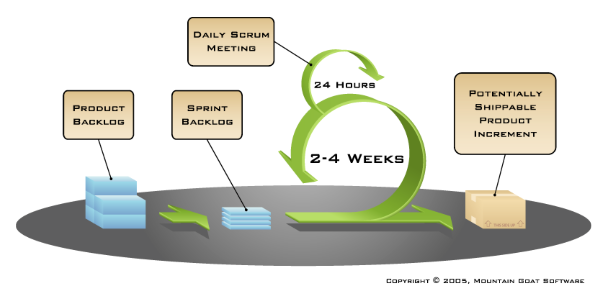
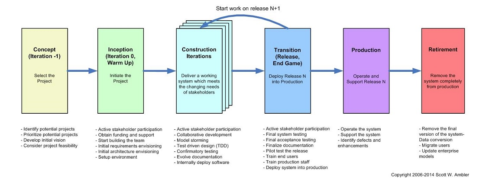
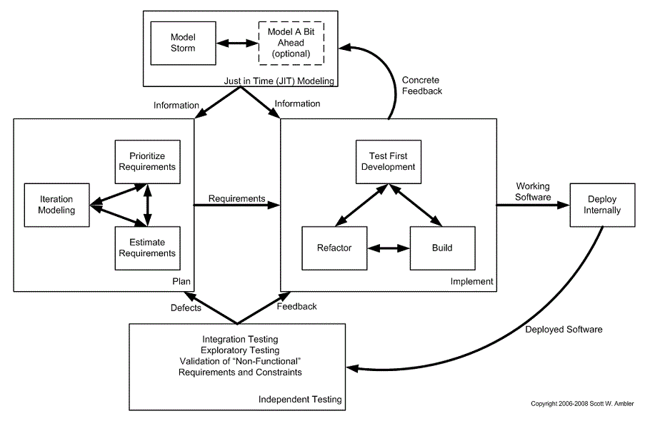

# SENG330 – OO Design
## Lecture 3 – Agile Processes
Neil Ernst
<!-- page_number: true -->
<!-- footer: (c) 2017 Neil Ernst  -->

---
# Learning Goals

*  Describe the commonalities of agile software development.
*  Describe the software process described by Scrum, and a disciplined agile approach.

--- 

# The Agile Manifesto
* Individuals and interactions OVER processes and tools
* Working software OVER comprehensive documentation
* Customer collaboration OVER contract negotiation
* Responding to change OVER following a plan
---

# Agility and Route Finding Analogy

* recall the Cynefin distinction: Simple, Complicated, Complex, Chaotic
* how does that work with a task like "Get to Bamfield"

---

# What is "Agility"
* Adapt to change
	* Particularly changes in requirements
	* Use frequent, short iterations to flatten cost curve
* Focus on working software
	* Measure of success: What *works*
* Process based on collaboration
	* Heavy customer involvement
* A sustainable process
	* Find a cadence that delivers reliably

---
# Drawbacks of Agile
* Harder to enforce with inexperienced programmers 
	* Can fallback into cowboy coding
* Requires close customer involvement 
* Hard to estimate completion schedule 
* Increases the risk of feature creep
	* Adapting is good, but you need to draw the line
* Can be inefficient
	* No BDUF saves time, but
	* Too much refactoring can be costly
---
# Building a car iteratively

(poll)

---

# Class Activity – Scenarios
Turn to your neighbor and discuss which process to use and why for each project.

## Project 1:
Build a fire alarm system
Company: well organized, 100s of developers

## Project 2:
Build a social network application (eg. facebook) 
Company: startup

---

# Scrum Lifecycle
*Management framework* for incremental product development
* Self-organizing, cross-functional teams
* Product progresses in a series of two- to four-week (fixed length) iterations: **sprints**
* Every iteration produces a potentially shippable (properly tested but not complete) product
* Requirements are captured as items in a list: **product backlog** 
* The business sets the priorities.
* No specific engineering practices prescribed

---
# Scrum process model

---
# Scrum artifacts
Product Backlog
* prioritized list of requirements (or wishlist) that describes all desired functionality

Product Backlog Item
* specifies a customer-centric feature (User Story form) – effort estimated by team, business value estimated by Product Owner

Sprint Backlog
* contains list of tasks that are negotiated by team and product owner from Product Owner for the sprint

Burndown Chart 
* Total remaining team task hours within one sprint

--- 
# "Disciplined" Agile

* Scale agile for large organizations
* Take Scrum and make it more predictable
* People Love Process

---

# Construction iteration

---
# Summary
* Agile is a reaction to over-emphasis on the non-working code parts of the SDLC
* Iteration helps us discover new requirements and constraints
* Scrum is one approach to iteration
* In larger settings, with multiple teams, some more discipline is available
