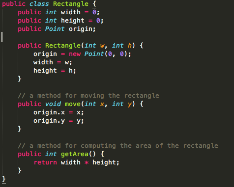
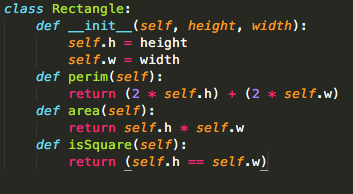

#  SENG330 -  OO Design
# Lecture 6 - Introduction to Object Orientation and DDD
Neil Ernst
<!-- page_number: true -->
<!-- footer: (c) 2017 Neil Ernst  -->

---

# What are Objects (in PL)
* everything is an object
* objects have attributes/state and behavior
* things that send and receive messages ("Agents")
	* we can choose different senders and receivers
	* we can send different messages
	* depending on the type of message, might have different receivers
	* the sender doesn't know/care about *how* the message is dealt with	
---
# Design Concepts
(to support system QA)
* **information hiding** -> sender of message doesn't know what receiver does with it
* **inheritance** -> we can have types and sub-types of objects
* **instances** -> we can have generic objects (classes of objects) and instances of those classes
* **overriding** -> we can search for an object to handle our message
* **polymorphism** -> our "address"/label for an object might refer to different subtypes

---

  from Eric Evans

---
# "Objects" and DDD
>Object-oriented programming is suitable for model implementation because they are both based on the same paradigm. Object-oriented programming provides classes of objects and associations of classes, object instances, and messaging between them. OOP languages make it possible to create **direct mappings** between model objects with their relationships, and their programming counterparts. (DDD book)

---
# Building a Domain Model
<!-- uses Evans Voyage example -->
<!-- uses DDD Simple example on planes -->
<!-- took longer than expected to do 1 -->

---
# Types of Domain Objects
Object types will depend on what you care about.
* Entity
	* things with persistence (e.g. Customer)
	* things with unique identifiers
	* not everything should be an entity

*Aside: what is a "firm"?*

---
# Value Object
* transient and easy to create/discard (e.g. Points, ints)
* low-cost for memory, enables optimizations
* one instance with many references
* for most cases, immutable (create another one)
* often used as attributes of Entities

*Aside: what is an "address"?*

---

# Service Objects
* domain 'verbs' which don't belong to any objects
* important behaviour often at the infrastructure layer
* stateless/functional (e.g. "retrieve X")

Transfer funds vs. save to Excel

---
# Object Relationships
What do the lines mean?
An association between two boxes in the model must be realized in the software.
* But how you implement that is up to you and depends on different factors (object reference, database call, collection vs. single).
* Our domain model should clarify 
	* directionality
	* cardinality
    
---

# OO in different flavours 
   
---
