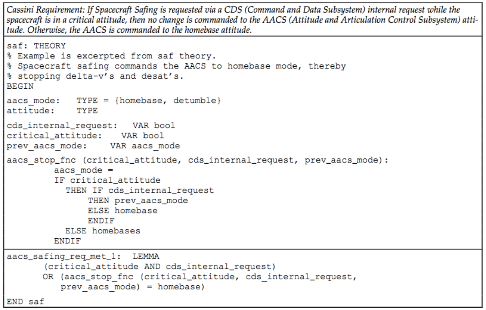
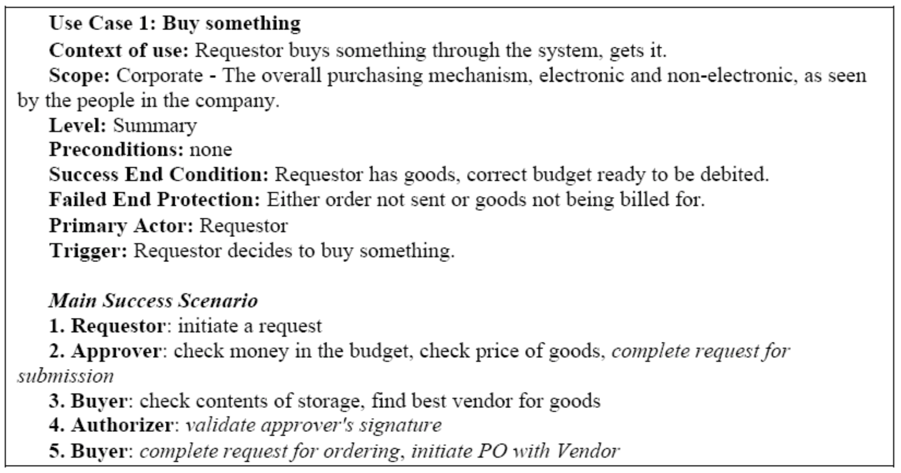
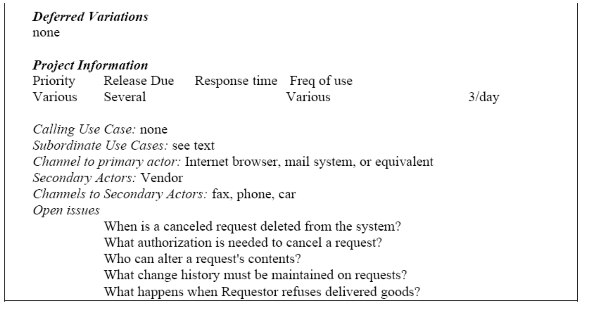
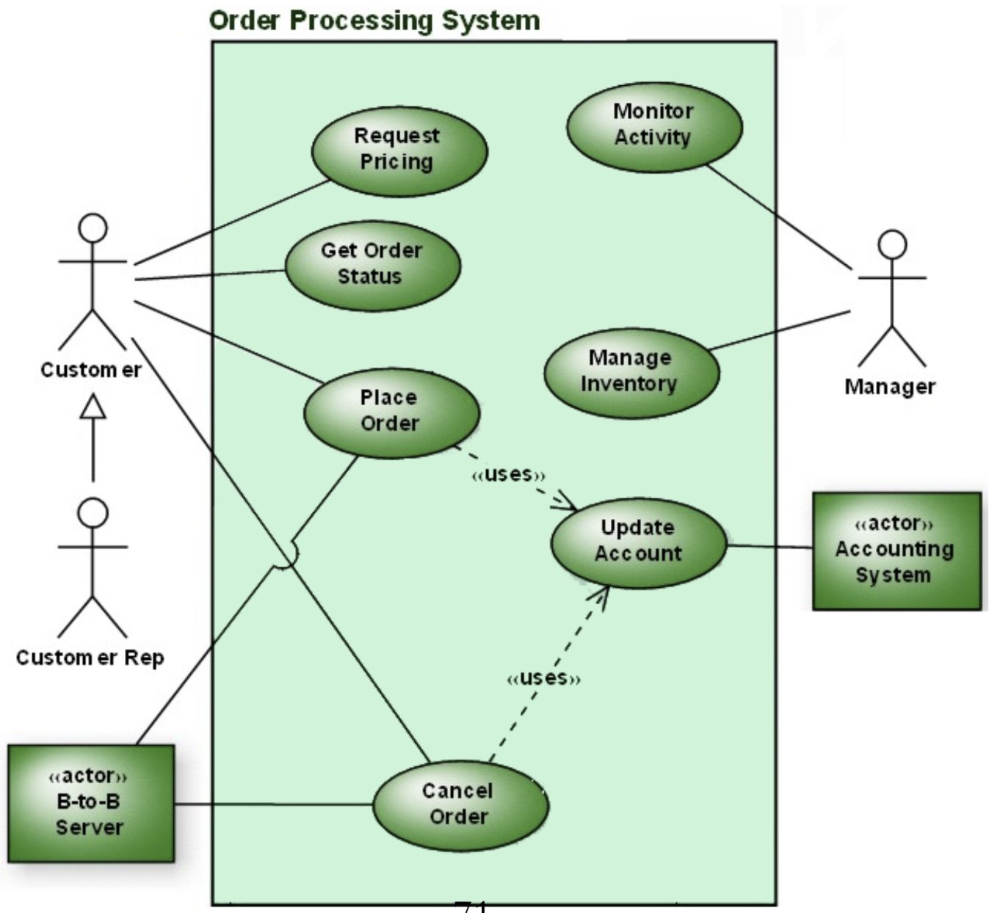

# Why UML?
Before we get into the mechanics of use cases, it's useful to discuss why we have chosen UML as the diagram format. <!-- any ideas/who has used it in the past -->
It is 'universal' in the sense that there are no other approaches that are more well-used (except for Simulink perhaps in the safety critical domain). It does 99% of what you need a diagram / model tool to do for you. [Marian Petre's study](https://dl.acm.org/citation.cfm?id=2486883) showed that many individuals are not using it much. Whether this is because it is not suited to the task, or because no one wants to do the task, is unclear.

Martin Fowler made the [useful distinction](https://martinfowler.com/bliki/UmlMode.html) of 3 types of models. 

1. **Model as Sketch** - what we will use in this course. It is a cognitive aid for whiteboard and napkin design planning.
2. **Model as BluePrint** - the models are a set of complete & consistent blueprints to hand the design to the developers. The term "Computer Aided Software Engineering" or CASE tool is part of this approach.
3. **Model as Programming Language** - extend the blueprints with semantics like constraints and error handling, and you can use it as a 'fifth-generation' programming language to generate code automatically. In practice this works only in a limited set of domains, likely *simple* per the Cynefin quadrants, and things like safety critical software. Simulink is a tool that can generate low level C code for embedded controllers, for example.

I suggested ArgoUML, but PlantUML is even simpler, and online. - http://www.plantuml.com/plantuml/uml/SoWkIImgAStDuNBAJrBGjLDmpCbCJbMmKiX8pSd9vuBmWC8WMIk5zFpybAJAL2w7rBmKe1u0

# Use Cases
There are something like 14 diagram types in UML2, but in this class we will talk about only 2 in detail, and one other one tangentially. These are the *class diagram*, the *use case diagram*, and the *sequence diagram*.

## Digression: views on a system. 
We can think about software as a set of structures for solving a problem. There are many structures we can look at, but they tend to be grouped into three main categories. One, the **module** structures, which talk about the set of implementation units we need to be concerned with. Think of these as classes, packages, dependency relations between them. Two, the **component and connector structures** that capture the runtime information about the system. This is where we capture interesting information about how the system is structured at runtime. For example, how many components will be connected to our publisher, how much latency will the message bus have, how we distribute processing over different nodes. Finally, we have the **allocation structures**, the mapping from system elements to non-software elements. For example, where the software will be run, how we will package it, who is going to work on it, what the network topology looks like.

Think of class diagrams as capturing the module structures (things at development time) and the sequence diagram as capturing system components at runtime. The use case diagram captures the requirements our software elements will have to map to.

Use cases are ways of capturing what we learned in the gathering of the requirements. We should start having a concrete picture of what the user wants the system to be doing, in the problem language. It is a description of the possible sequences of interactions between a system and its external actors, related to a particular goal. Many use cases for an entire system. Does not constitute the entire specification. Done in a fast way at the beginning of the inception phase.

## Digression: Formal Requirements 
In some cases, we *must* have formality in order to have guarantees about our system. At NASA, for example, a great deal of money is spent on requirements analysis and verification because the systems are very complex and very expensive. This clearly doesn't scale for most software projects.

<!-- question: identify domain elements here -->

# Types of Use Cases
- The brief use case, with a few sentences summarizing the use case.
- The casual use case, with one or two paragraphs of text, informal.
- Fully-dressed use case, which is a formal document on a detailed template. This is the most common meaning. The reading calls these Formal System Use Cases. Note, these are very easy to mix implementation into, and thus obscure the true domain elements we should focus on. It is also very easy to overdo these as a way of procrastinating over writing code.

# Use Case Diagrams
A Use Case Diagram shows packaging and decomposition of use cases, but not their content. Each ellipse is a use case. Only top-level services should be shown, and not the internal behaviour. Actors can be other systems.  The system outline can be an actor in other diagrams. They are not enough by themselves. We must individually document use cases. 

> It is very easy for use case modelling to become un-agile. To prevent this from happening you need to focus on creating artifacts that are just barely good enough, they don't need to be perfect.

# Use Cases and DDD
In DDD we try to encapsulate domain objects with the behaviour they exhibit. However if our behaviour is getting too complex, we have probably not broken the model down sufficiently, and this is an opportunity for gaining more understanding. This depends a lot on the context our system is in. For example, if we have a Car in our domain, it may be natural to say it should have a property like top speed, and be able to report fuel consumption. But if our domain is car **maintenance**, these are not very important, and instead we have a behaviour like "report diagnostics". But as we dig into that concept, we realize there are many different aspects of diagnosis: different parts of the car, different tools required, error codes, and so on. It now seems like diagnosis is its own use case, and likely its own Entity - DiagnosticElement.

In the end, full use case approach is likely to miss aspects of the design which are relevant. Use use cases as a way to uncover interesting properties of the domain you might be missing. Use cases don't (and shouldn't) talk about building the Machine. https://stackoverflow.com/questions/3173070/design-methodology-use-case-driven-vs-domain-driven

