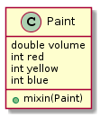
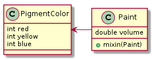
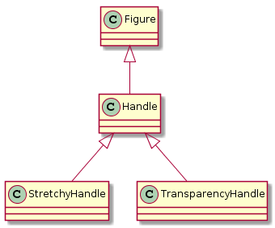
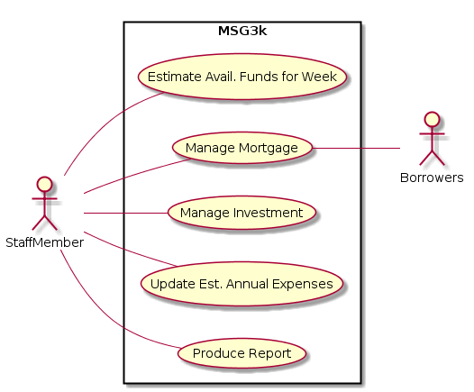

# SENG330 -  OO Design
# Lecture 9 - OO Principles
Neil Ernst
<!-- page_number: true -->
<!-- footer: (c) 2017 Neil Ernst  -->

---

# Overview/Learning Objectives
* understand the importance of design
* introduce basic principles in OO design

> A good design principle should help generate ideas and enable you to think through design implications. 
> — Rebecca Wirfs-Brock
---
# Writing vs. Coding
* As in English class, ultimately we care about *communicating* 
* What are some key principles in writing well?
* What about writing code? What bothers you about bad code? What is "bad"?

---
# Developing an Aesthetic
* Design and write a lot of code, and read even more code
* Some resources to help:
	* Beck, [Implementation Patterns](https://www.infoq.com/articles/implementations-patterns-br)
	* Hunt and Thomas, [Pragmatic Programmer](https://en.wikipedia.org/wiki/The_Pragmatic_Programmer)
	* Martin, [Clean Code](https://www.amazon.ca/Clean-Code-Handbook-Software-Craftsmanship/dp/0132350882)
	* Bloch, [Effective Java](https://www.amazon.ca/Effective-Java-2nd-Joshua-Bloch/dp/0321356683)
	* Kernighan & Pflauger, [Elements of Programming Style](https://en.wikipedia.org/wiki/The_Elements_of_Programming_Style)
	* [Architecture of Open Source Applications](http://aosabook.org/en/index.html) • [Beautiful Code](https://www.amazon.com/Beautiful-Code-Leading-Programmers-Practice/dp/0596510047/)
	* Various blogs and articles on places like InfoQ.

---

# Design for Modularity
<table>  <col width="600">

<tr><td>Decomposable - can be broken down into modules to reduce complexity and allow teamwork</td> <td rowspan=5> </tr>
<tr><td>Composable  - "Having divided to conquer, we must reunite to rule [M. Jackson].”</td></tr>
<tr><td>Understandable - one module can be examined, reasoned about, developed, etc. in isolation</td></tr>
<tr><td>Continuity - a small change in the requirements should affect a small number of modules</td></tr>
<tr><td>Isolation - an error in one module should be as contained as possible</td></tr>
</table>

<em>taken from UW CSE331 - Hal Perkins</em>

---

# Cohesion and Coupling
* **Cohesion** is internal to an object, describing its independence. High cohesion implies doing one thing well. <!-- Employer does not "Pay" Employee -->
* **Coupling** is the amount of dependency *between* components. High coupling makes the preceding modularity approaches harder. 
* Modular systems have objects with high cohesion and low coupling

---

# God Class
* the class that does it all
* common when moving from imperative languages or scripting
* low cohesion - does many things, not connected
* low coupling externally but now high coupling internally
* look for classes with many many methods.

---
# Naming
* Surprisingly, one of the most important tasks developers have
* Rely on naming conventions (yours, project, language, corporate)
* Name classes to describe *effects* and *purpose*, not implementation

---
# A DDD example

<!--
@startuml
class Paint {
  double v
  int r
  int y
  int b
+paint(Paint)
}
@enduml -->

<code>
public void paint (Paint paint) {

 &nbsp;  v = v + paint.getV(); //after mixing, sum volume
 &nbsp;  //complex color mixing logic 
 &nbsp;  // assign new r, b, y values
  }</code>
  
---
# Unhelpful, written for the implementer
<code>

public void testPaint() {
&nbsp;   Paint yellow = new Paint(100.0, 0, 50, 0);
&nbsp;   Paint blue = new Paint(100.0, 0,0,50);
&nbsp;   yellow.paint(blue);
&nbsp;   //should get green with 200.0
}
</code>
  
---
## Better - write from interface user point of view
<code>

public void betterTestPaint() {
&nbsp;   Paint ourPaint = new Paint(100.0, 0, 50, 0);
&nbsp;   Paint blue = new Paint(100.0, 0,0,50);
&nbsp;   ourPaint.mixin(blue);
&nbsp;   //should get green with 200.0
&nbsp;   assertEquals(200.0, ourPaint.getVolume(), 0.01);
}
</code>

---
# Improved class naming
<!-- @startuml
class Paint {
  double volume
  int red
  int yellow
  int blue
+mixin(Paint)
}
@enduml
-->
 =====> 

---
<!-- 
@startuml
class Paint {
  double volume

+mixin(Paint)
}
class PigmentColor {
  int red
  int yellow
  int blue
}
PigmentColor <- Paint
@enduml
-->

---
# One more refactoring
<!--
@startuml
class Paint {
  double volume

+mixin(Paint)
}
class PigmentColor <<value>> {
&nbsp;   int red
&nbsp;   int yellow
&nbsp;   int blue
mixedWith(PigmentColor, double): PigmentColor
}
PigmentColor <- Paint
@enduml
-->

<code>
//in Paint 
public void mixIn(Paint other) {
&nbsp; volume = volume + other.getVolume();
&nbsp; double ratio = other.getVolume()
&nbsp; pigmentColor = pigmentColor.mixedWith(other.pigmentColor(), ratio);
}
in PigmentColor
&nbsp; // many lines of color-mixing logic
</code>

---
# Naming
>  For example, in the HotDraw drawing framework, my first name for an object in a drawing was **DrawingObject**. Ward Cunningham came along with the typography metaphor: a drawing is like a printed, laid-out page. Graphical items on a page are figures, so the class became Figure. In the context of the metaphor, **Figure** is simultaneously shorter, richer, and more precise than DrawingObject."

If a class is hard to name, it is probably doing too much.

---
# Naming
Rate of change:
>  Things that change at the same rate belong together. Things that change at different rates belong apart. This principle is true of both the data manipulated by the program--**two variables that always change at the same time belong in the same object**--and the structure of the program--**two functions that change at the same time belong in the same class**.

"Empathy in naming" -> "if I searched for this function, what would I want it called?"
   
 https://www.facebook.com/notes/kent-beck/naming-from-the-outside-in/464270190272517/

---
# Subclasses 
Need to communicate what class they are like and how they are different. 
* Figure has a Handle
* Handle has different subclasses of Handle

<!-- 
@startuml
class Handle {
}
class Figure {
}
class StretchyHandle {
}
class TransparencyHandle {
}

Figure <|-- Handle
Handle <|-- StretchyHandle
Handle <|-- TransparencyHandle
@enduml

-->

---
# MSG Case Study: Mortgages
The MSG foundation lends money to first time borrowers to help them purchase a home. The buyers put a *down payment* of their own money, say 10% of the purchase cost. The foundation loans them the rest and charges interest over a period of time below bank rates. The foundation wants to automate their business.
* Mortgagees sign a document giving the foundation their home as security.
* Mortgagees have to pay insurance and taxes into escrow.
* To qualify mortgagees have to have a certain income.

---

<!--
# PlantUML code
@startuml
left to right direction
skinparam packageStyle rectangle
actor StaffMember
actor Borrowers
rectangle MSG3k {
  StaffMember -- (Estimate Avail. Funds for Week)
  (Manage Mortgage) -- Borrowers
StaffMember -- (Manage Mortgage)
StaffMember -- (Manage Investment)
StaffMember -- (Update Est. Annual Expenses)
StaffMember -- (Produce Report)

}
@enduml
-->
---

---
# Key OO Principles - Overview
1. Cohesion/Coupling
2. Polymorphism
3. SOLID
	1. Single Responsibility
	2. Open/Closed
	3. Liskov Substitution
	4. Interface Segregation
	5. Dependency Inversion/Inversion of Control

<!--5. Dynamic Dispatch-->

4. Refactoring
 
 ---

# Cohesion and Coupling
* **Cohesion** is internal to an object, describing its independence. High cohesion implies doing one thing well. <!-- Employer does not "Pay" Employee -->
* **Coupling** is the amount of dependency *between* components. High coupling makes the preceding modularity approaches harder. 
* Modular systems have objects with high cohesion and low coupling

---
# Polymorphism
"many shapes"
* refresher: types, inheritance, and classes in Java -> File example

Benefits
* decouple runtime resolution from compile time resolution ('late binding') 
  * in Java, with reflection APIs
* extensibility of the design

Drawbacks are comprehensibility and potential for overuse

---

# Single Responsibility
* CRC diagram for MSG case -> "A responsibility is anything that a class knows or does"
* a class should have a single purpose, collecting together a set of **related** sub-responsibilities
* "class only has a single reason to change"
* a Rectangle that calculates *area* and *draws itself*
* what two types of responsibility should almost certainly be separated? <!-- business logic and storage, anything crossing 'layers'-->

---
<!-- 3rd lecture got to here -->
# Open Closed Principle
"Objects are open for **extension** but closed for **modification**."
* use inheritance and abstraction

Ask: if a new object of type X is needed, where do you make changes?
* minimize changes to existing objects
* contrast: lengthy <code>switch</code> statements (or using <code>instanceof</code>)

**Encapsulation**: keep data and operations together. Ensure internal details don't have external effects (eg. member variables)
* Does inheritance violate this?

---
# Liskov Substitution Principle (LSP)
"Functions that use Base Classes must be able to use Derived Classes without being aware of it"
* a change to a derived class (subtype) shouldn't affect the program using the base class (OCP)
> The validity of a model can only be expressed in terms of its clients (tests).
<!-- OperatingAccount should be acceptable anywhere Account is used -->

---
# Interface Segregation
"Clients should not depend on interfaces they don't use"
* do not create coupling between objects through *implicit dependencies* on a common interface (rich interface)
<!-- A single UI interface may not make sense if the services are very distinct (e.g. different users) -->

---
# Dependency Injection/Inversion of Control
> A. High Level Modules Should Not Depend Upon Low Level Modules. Both Should Depend Upon Abstractions.
> 
> B. Abstractions Should Not Depend Upon Details. Details Should Depend Upon Abstractions."

Separate configuration from use, especially in the use of 3rd party libraries.
<!-- couple dynamically, depend on interfaces/supertypes-->
<!-- report creation (the abstraction) should not depend on the details (PDF etc) -->

---
# DI Frameworks
Frameworks like [Guice](https://github.com/google/guice/wiki/Motivation), [Spring](https://www.mkyong.com/spring/spring-dependency-injection-di/) allow for "injection" of the dependencies 
* e.g., at runtime, allow new instances of Report
* especially useful for testing (code no longer cares if it gets a mock or the real object)
<code style="font-size:14pt"> 
public class RealBillingService implements BillingService {
 &nbsp; public Receipt chargeOrder(PizzaOrder order, CreditCard creditCard) {
    &nbsp;&nbsp;CreditCardProcessor processor = new PaypalCreditCardProcessor();
    &nbsp;&nbsp;TransactionLog transactionLog = new DatabaseTransactionLog();
 </code>
 
---
## DI - 2
<code style="font-size:14pt">

public class BillingModule extends AbstractModule {
&nbsp;@Override 
&nbsp;protected void configure() {
&nbsp;&nbsp;bind(CreditCardProcessor.class).to(PaypalCreditCardProcessor.class);
&nbsp;&nbsp; // more bindings
}
...
public class RealBillingService implements BillingService {
&nbsp;&nbsp;@Inject
&nbsp;&nbsp;public RealBillingService(CreditCardProcessor processor, TransactionLog transactionLog) {
&nbsp;&nbsp; this.processor = processor;
&nbsp;&nbsp;this.transactionLog = transactionLog;
  }
</code>

---
 
<!-- # Dynamic Dispatch -->
 
# Refactoring
refactor if there is a symptom, not just for the sake of it. (somewhat violated in learning refactoring!)
<!-- Movie example -->

---
# Exercise
Critique and refactor/redesign the code.
> A program to calculate and print a statement of a customer's charges at a video store. The program is told which movies a customer rented and for how long. It then calculates the charges, which depend on how long the movie is rented, and identifies the type movie. There are three kinds of movies: regular, children's, and new releases. In addition to calculating charges, the statement also computes frequent renter points, which vary depending on whether the film is a new release.